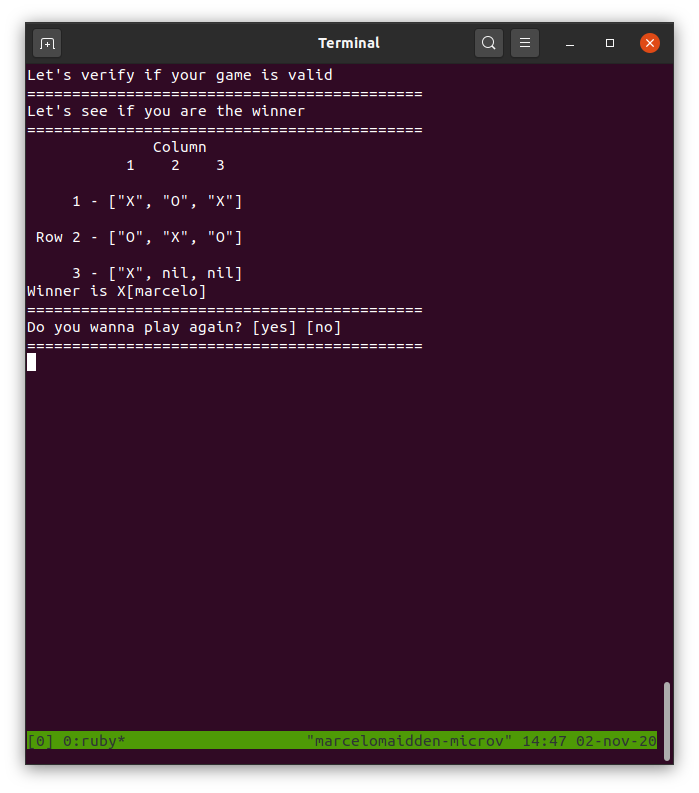

# OOP (Object Oriented Programming)
# Tic Tac Toe Game

# A project made in Ruby to serve as a Tic Tac Toe Game for educational purposes

## Built With

- Ruby

## Getting started
# In order to run the project locally follow all steps below:
Install git following the instructions available at [Git](https://git-scm.com/downloads)

Clone the repository typing the command below on your preferred terminal

    git clone https://github.com/marcelomaidden/ruby-milestone-setup

After you have cloned the repository, enter the directory typing 
        
    cd ruby-milestone-setup

Install ruby following the instructions available at [Ruby](https://www.ruby-lang.org/en/downloads/)

Then run the command below

    ruby bin/main.rb

## Rules for TIC-TAC-TOE

1. The game is played on a grid that's 3 squares by 3 squares.

2. You are X, your friend is O. Players take turns putting their marks in empty (nil) squares.

3. The first player to get 3 of her marks in a row (up, down, across, or diagonally) is the winner.

4. When all 9 squares are full, the game is over. If no player has 3 marks in a row, the game ends in a tie.

## Live Demo

[Live Demo Link](https://repl.it/repls/StupendousWearyEfficiency#README.md)

## Author

**Marcelo Araújo**

- GitHub: [@marcelomaidden](https://github.com/marcelomaidden)
- Twitter: [@marcelomaidden](https://twitter.com/marcelomaidden)
- LinkedIn: [Marcelo Fernandes de Araújo](https://www.linkedin.com/in/marcelo-fernandes-de-ara%C3%BAjo-56700a171/)

## Acknowledgements
- Ruby creators

##  Contributing

Contributions, issues, and feature requests are welcome!

## Show your support

Give a ⭐️ if you like this project!

## License

This project is [MIT](./LICENSE) licensed.
